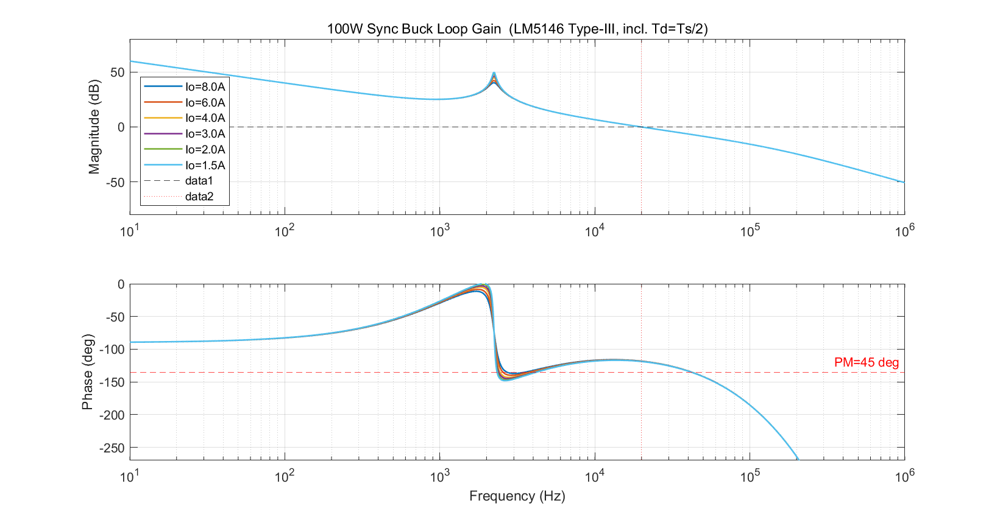
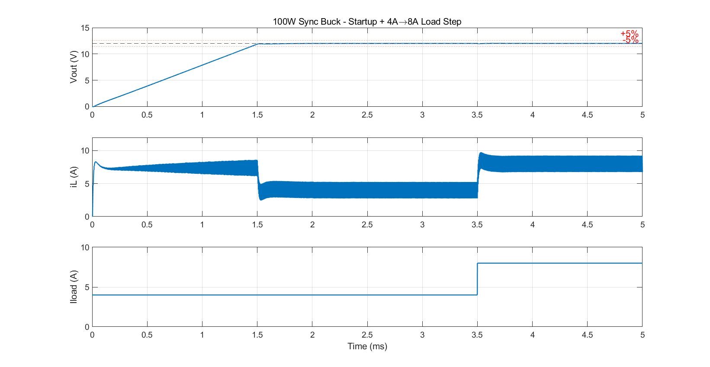
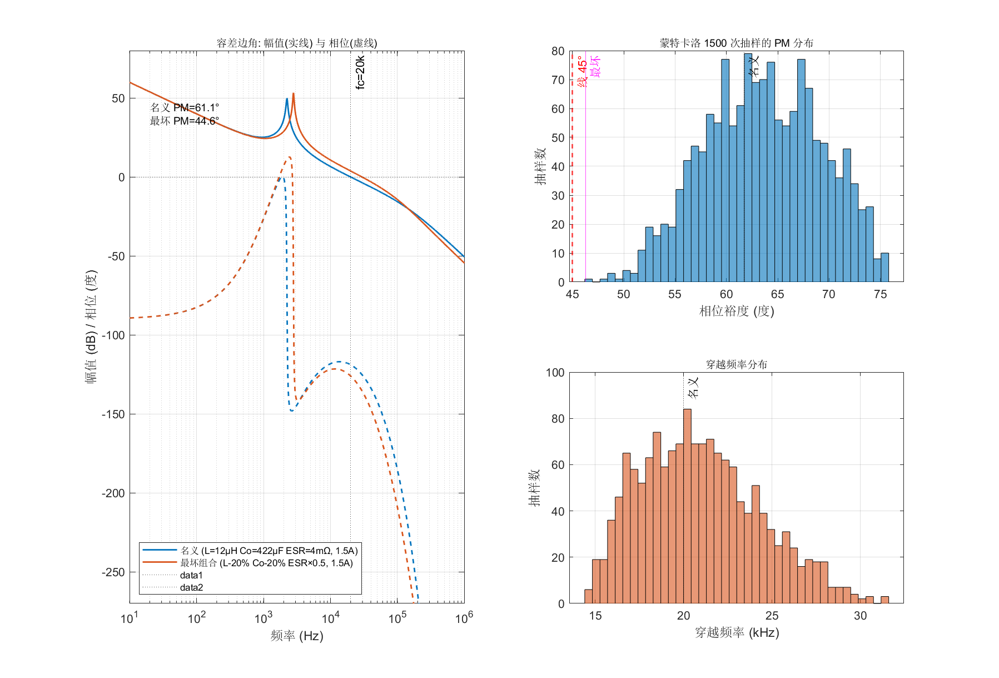

# 100W 同步 Buck 开关电源 · 48V → 12V / 8A

**Synchronous Buck Converter · 48 V → 12 V / 8 A · 100 W**
LM5146 电压模式 + 输入前馈 · Type III 补偿 · 300 kHz

从规格、拓扑、器件选型，到环路补偿与保护设计的一整条链路。每一步的**取舍和理由**都写了下来，环路与时域都做过 MATLAB 仿真验证。

> **状态：设计完成，仿真验证通过。实物未打板。**

---

## 目录

- [一、规格](#一规格)
- [二、设计链路与关键结论](#二设计链路与关键结论)
  - [原理图六块速览](#原理图六块速览)
- [三、关键取舍](#三关键取舍这个项目真正想说清的部分)
- [四、仿真验证结果](#四仿真验证结果)
- [五、文件导航](#五文件导航)
- [六、设计输入与边界（诚实说明）](#六设计输入与边界诚实说明)
- [七、参考](#七参考)

---

## 一、规格

| 项 | 值 |
|---|---|
| 输入电压 | 48 V 标称（**36 – 60 V** 工作范围） |
| 输出电压 | **12 V** |
| 输出电流 | **8 A 峰值（5 s） / 6 A 连续** |
| 输出功率 | 100 W 峰值 / 72 W 连续 |
| 开关频率 | **300 kHz** |
| 拓扑 | 同步 Buck |
| 控制器 | **TI LM5146**（100 V，电压模式 + 输入前馈） |
| 补偿方式 | Type III |
| 目标效率 | 纸面最保守 **93.9%**（实测预期 94 – 95%） |

### 降额口径

电感与 MOSFET 按 **8 A** 选型（不饱和、不超 SOA），**散热按 6 A 连续**校核。

理由：8 A 连续时上管结温会到 115 ℃，靠热容撑 5 秒可行，持续跑可靠性差。所以标称 100 W 是**峰值**，连续能力是 72 W。

---

## 二、设计链路与关键结论

| 环 | 内容 | 关键结论 |
|---|---|---|
| 01 | [拓扑与器件应力](01-拓扑与器件应力.md) | 为什么选同步整流；占空比极值 75%/20%；耐压与电流应力 |
| 02 | [电感设计](02-电感设计.md) | **L = 12 µH**；纹波系数 r = 0.3 的取舍；Isat/Irms/DCR 三指标选型 |
| 03 | [电容设计](03-电容设计.md) | **纹波由 ESR 决定，不是容量**；输入电容 3.82 A RMS；输入 LC 谐振要阻尼 |
| 04 | [开关管与驱动](04-开关管与驱动.md) | 上管挑开关快、下管挑内阻低；**Qrr 是隐性大损耗**；自举 / 死区 / Rg |
| 05 | [控制模式与电流采样](05-控制模式与电流采样.md) | 电压模式 vs 峰值电流模式；**下管 Rds(on) 无损采样**；限流点 12 A |
| 06 | [环路补偿](06-环路补偿.md) | Type III 设计；**穿越 20 kHz，最恶劣相位裕度 61.1°**（已仿真） |
| 07 | [保护设计](07-保护设计.md) | OCP / 软启动 / UVLO / OVP / 短路；**带载启动会撞限流点**这个坑 |
| 08 | [热设计](08-热设计.md) | 结温计算、PCB 铜皮散热、降额口径的完整论证 |
| 09 | [原理图与 BOM](09-原理图与BOM.md) | 六块拓扑、BOM、布局七条、打样检查清单 |

### 原理图六块速览

原理图按功能分成六块画，每块的详细接法见 [09](09-原理图与BOM.md) 9.1：

| 块 | 内容 | 一句话 |
|---|---|---|
| 1 | **输入滤波** | 4 颗陶瓷（10µF/100V）扛 3.82 A RMS + **1 颗固态专门做阻尼**（它的 ESR 才是重点，不是容量） |
| 2 | **功率级** | Q1/Q2 同步半桥 + L1（12 µH）；漏极焊盘铺铜 ≥2 cm² |
| 3 | **控制器 + 自举 + 驱动** | LM5146 全 20 脚接线；自举二极管已集成在芯片内，外部可省 |
| 4 | **反馈 + 补偿** | Type III：RFB1/RFB2 分压 + RC1/CC1/CC2/CC3/RC2 五颗 |
| 5 | **保护外围** | **只有 OVP 要外置**（LM393 拉低 EN 脚）—— 其余 OCP/UVLO/OTP/软启动全在芯片里 |
| 6 | **输出** | 2 颗 22µF + 1 颗 470µF 固态 |

---

## 三、关键取舍（这个项目真正想说清的部分）

**① 为什么用同步整流，而不是异步（二极管）**
下管的导通损耗从"二极管压降 × 电流"（约 3 W）换成"Rds(on) × Irms²"（不到 0.5 W）。**省下约 3 W**，在 100 W 的机器上就是 3 个百分点的效率。代价是多一颗管子 + 一套驱动 + 死区控制。

**② 开关频率为什么定 300 kHz —— 这是一个已知偏高**
300 kHz 让电感电容变小，但**反向恢复损耗随频率线性增长**。实际管子的 Qrr 是 249 nC（比早期纸面假设大 5 – 6 倍），算下来 Qrr 一项就吃掉约 3.6 W，效率从纸面的 96.6% 下修到 **93.9%**。
**结论：200 kHz 会是更稳的选择。** 保留 300 kHz 是权衡后的取舍，不是没算过。

**③ 为什么用电压模式 + Type III，而不是峰值电流模式 + Type II**
电压模式的代价是 LC 双极点（−40 dB/dec + 180° 相位滞后，且 Q 随负载变），需要 Type III 的**两个零点**去抵。换来的是**抗噪**——电流模式要在开关节点采样，噪声敏感，需要前沿消隐。
**输入前馈把 Vin 从环路里消掉了**，所以 36 V 和 60 V 下的穿越频率与相位裕度完全一样。

**④ 上下管用了同款 —— 这是一个已知偏差**
理论上应该分开选：上管导通时间只有 25%，导通损耗不心疼，挑 **Qg/Qgd 小、开关快的小 die**；下管导通 75%，才需要低内阻。
LM5146 手册官方的 Design 2 就是这么选的（上管 22 mΩ、下管 10 mΩ）。本项目为了少一个料号用了同款，**是取舍，不是不知道**。

**⑤ 最恶劣工况要分维度看**
> 器件应力看 **36 V**（占空比最大、电流应力最大）
> 环路带宽看 **60 V**
> 相位裕度看 **轻载**（Q 最高）
> 热看 **满载**

---

## 四、仿真验证结果

### 环路（`sim/loop_bode.m` → `sim/loop_bode.png`）

```
功率级   LC 双极点 2236.5 Hz，ESR 零点 94.3 kHz，Q = 7.35(满载) / 22.3(1.5A)
补偿器   Type III：零点 1118 Hz / 2236 Hz，极点 94.3 kHz / 150 kHz
穿越频率 19,997 Hz     相位裕度 61.1°（最恶劣 @1.5A）     增益裕度 14.9 dB
Q 变化 3 倍，相位裕度只掉 0.6°  ← 两个零点抵双极点的效果
（已计入调制器采样延时 Td = Ts/2，它单独吃掉 12°）
```



### 输入前馈到底管不管用（`sim/loop_feedforward.m` → `sim/loop_feedforward.png`）

上面那句"前馈把 Vin 消掉了"不是嘴上说的，是跑出来对照过的 —— 同一套补偿器，改输入电压：

| | fc 变化（36 V → 60 V） | PM 变化 | 增益裕度 |
|---|---|---|---|
| **无前馈**（固定斜坡） | 15,272 → 24,713 Hz（**+61.8 %**） | 62.9° → 58.3°（**−4.6°**） | 17.4 → 13.0 dB |
| **有前馈**（斜坡 = Vin/15） | 19,995 → 19,995 Hz（**+0.0 %**） | 61.1° → 61.1°（**0.0°**） | 14.9 → 14.9 dB |

没有前馈的话，48 V 设计的环路拿到 60 V 上跑，穿越频率会冲到 24.7 kHz（设计值 20 kHz），相位裕度掉 4.6°。**前馈把这 4.6° 买回来了。**

### 极端输入电压下跑时域（`sim/switching_corners.m` → `sim/switching_corners.png`）

同一套补偿器，只改输入电压，两端都稳：

| | 稳态 Vout | 纹波 | 负载跳变 2 A → 8 A 跌落 | 恢复时间 |
|---|---|---|---|---|
| **36 V**（占空比 33 %） | 11.9991 V | 10.92 mV PASS | −94.0 mV（−0.78 %） | 37 µs |
| **60 V**（占空比 20 %） | 11.9988 V | 13.68 mV PASS | −96.3 mV（−0.80 %） | 37 µs |

两端几乎一模一样 —— 这就是前馈在时域上的样子。

### 时域（`sim/switching_sim.m` → `sim/switching_sim.png`）

| 项 | 规格 | 仿真结果 |
|---|---|---|
| 稳态输出 | 12.000 V | 11.9998 V |
| 输出纹波 | ≤ 120 mV | **11.6 mV** |
| 负载瞬态 4 A → 8 A 跌落 | ±600 mV | **−66.2 mV（−0.55%）** |
| 恢复时间（±0.5% 带） | < 200 µs | **23 µs** |
| 软启动 | — | 线性爬升，无过冲 |



### 保护行为（`sim/protection_sim.m` → `sim/protection_sim.png`）

保护不是只有公式，六个场景是真跑出来的：

| 场景 | 谷值电流峰值 | 跳闸 | 结果 |
|---|---|---|---|
| ① 满载启动，软启动 **1 ms** | **12.15 A** | 限流 3 次 @0.16 ms | ⛔ **输出只爬到 1.95 V，起不来** |
| ② 满载启动，软启动 **12 ms** | 8.55 A | 0 次 | ✅ 正常起振到 12.01 V |
| ③ 过流 2 A → **16 A** → 2 A | 12.18 A | 限流 3 次 @3.01 ms | ✅ 故障撤除后**自恢复**到 12.01 V |
| ④ UVLO 上电（20 → 45 → 25 V） | 7.17 A | 0 次 | ✅ 起振 **34.00 V**、关断 **32.00 V**，与设计值分毫不差 |
| ⑤ 输出短路（0.1 Ω 硬短） | 12.17 A | 限流 3 次 @3.00 ms | ✅ 逐周期限流 + 打嗝，不会一直烧 |
| ⑥ 反馈分压比漂移 15 % | 12.07 A | **OVP 1 次 @8.79 ms** | ✅ **只有 OVP 拦得住**（环路照跟不误） |

**①②用的是同一套硬件，只有软启动时间不同 —— 1 ms 起不来，12 ms 起得来。** 这就是软启动电容 `CSS` 为什么不能随便取的原因。

**⑤⑥是「环路拦不住、只有保护拦得住」的两类故障。** 短路时环路想尽办法把电压拉回来（越拉电流越大），靠逐周期限流每 3.3 µs 兜一次底；反馈漂移时环路反而**很乐意**把输出推到 14 V 去，直到 OVP 把 EN 拉低。

> ⚠️ 场景 ② 里满载启动的谷值峰是 **8.55 A**，比手算的稳态值（8.42 A 平均 − 1.25 A 半纹波 ≈ 7.17 A）高出约 1.4 A —— 那 1.4 A 是软启动结束瞬间的**瞬态峰值**。
> 按最坏批次跳闸点 9.6 A 算，余量只剩 **12 %**，比文档里手算的 33 % 要紧。**这是仿真抓出来的、手算漏掉的东西。**

> 📌 **顺带抓出来的两件事（都是建模仿真逼出来的，纸面推不出来）：**
> 1. **限流必须当拍终止，不能等开关周期边界。** 只在周期边界判决，会白白多送一整个周期（3.3 µs），电流冲到 **15 – 20 A** 才刹住；改成比较器当拍终止后，峰值稳稳压在 **12.1 – 12.2 A**（超调 1 %）。
> 2. **本项目 `SYNCIN` 接 VCC = 强制 PWM（FPWM），是允许倒灌的。** OVP 打嗝重启时输出还带着 13 V 电、而软启动基准从 0 起，环路会把下管常通、电感反向电流一路涨到 **−27 A** 去把输出硬拽下来。真实芯片有**反向电流限流**兜住（模型里按 6 A 补上）。

> 注：场景 ② 的 12 ms 软启动按 `CSS = 150 nF` 折算，**这个折算尚未逐条对照原始手册**，见下方「设计输入与边界」。

### 元件容差最坏情况（`sim/worst_case.m` → `sim/worst_case.png`）

上面所有仿真都用的**名义值**（L = 12 µH、Co = 422 µF、ESR = 4 mΩ）。真板子上元件是要跑的：电感量有批次公差、固态电容容量有公差、**ESR 受温度影响最大**。

补偿器元件值是**锁死的**（一块板只有一个 BOM），让功率级去跑偏，看相位裕度还剩多少：

| 维度 | 范围 | 理由 |
|---|---|---|
| L | ±20 % | 电感量批次公差 |
| Co | ±20 % | 固态电容容量公差 |
| **ESR** | **×0.5 ~ ×2** | 受温度/批次影响最大，给最宽的窗口 |
| 负载 | 1.5 ~ 8 A | Q 变化 3 倍，轻载最恶劣 |

**跑法一：边角网格（81 组合，可解释）**

```
PM 分布：最坏 44.6° / 中位 61.4° / 最好 76.6°      增益裕度最小 9.5 dB
最坏组合：L −20% (9.6µH) + Co −20% (337.6µF) + ESR ×0.5 (2.0mΩ) + 1.5A
          → fc = 29,495 Hz，PM = 44.6°  ⇒  低于 45°，FAIL
```

**跑法二：蒙特卡洛（1500 次随机抽样，看分布）**

```
PM 最坏 46.3°  /  1% 分位 51.6°  /  中位 63.5°  /  最好 75.7°
低于 45° 的比例：0.00 %
fc 范围：14,500 ~ 31,363 Hz（名义 19,978 Hz @8A）
```

**两条结论，一条好消息一条坏消息：**

- ✅ **随机抽样 1500 次，一次都没跌破 45°**（最坏 46.3°，1 % 分位还有 51.6°）。说明裕度对元件公差**总体上是够的**。
- ⚠️ **但边角网格把三个维度同时拉到最坏端点时，会跌到 44.6°**，刚好压线。**注意这是三个端点同时命中，概率极低**（蒙特卡洛 1500 次都没抽到），但它说明裕度**没有大到可以从容**。

**单维度单独拉满时的 PM（哪个维度最要命一目了然）：**

| 维度 | PM 范围 | 方向 |
|---|---|---|
| L −20 % | 58.3 ~ 58.8° | ↓ 掉 |
| L +20 % | 62.5 ~ 63.2° | ↑ 涨 |
| Co −20 % | 55.6 ~ 56.3° | ↓ 掉 |
| Co +20 % | 64.4 ~ 65.0° | ↑ 涨 |
| **ESR ×0.5** | **55.4 ~ 56.0°** | **↓ 掉最多** |
| **ESR ×2** | **72.1 ~ 72.7°** | **↑ 涨最多** |

**ESR 是个"反直觉"的旋钮：ESR 变大反而让相位裕度更好。** 因为 ESR 零点 `f_esr = 1/(2π·ESR·Co)` 会随 ESR 变大而**降低**，落在穿越频率附近就能多贡献一段相位超前。所以 **ESR 越小越危险**。

而固态电容的 ESR 恰恰是**低温大、高温小**。所以低温时裕度反而宽松，**高温才是裕度最紧张的工况** —— 这一点和"热了就担心"的直觉正好反着。




## 五、文件导航

```
├── README.md                本文件
├── 总览.md                   一页纸速览（发给别人看的那种）
├── BOM.tsv                  物料清单
├── BOM-说明.md               BOM 怎么读、哪些栏要你自己填
├── 00-设计大纲与进度.md      项目索引与验证结果汇总
├── 01 … 09                  设计链路（见上表）
├── sim/
│   ├── loop_bode.m          ① 环路 Bode + 相位裕度扫描（各负载）
│   ├── loop_feedforward.m   ② 输入前馈效果验证（有/无前馈 × 36/48/60 V）
│   ├── switching_sim.m      ③ 时域开关级仿真（启动 + 负载跳变 @48 V）
│   ├── switching_corners.m  ④ 时域极端工况（36 V / 60 V）
│   ├── protection_sim.m     ⑤ 保护行为（6 个场景）
│   ├── worst_case.m         ⑥ 元件容差最坏情况（边角网格 + 蒙特卡洛）
│   └── *.png                仿真结果图
├── datasheet/               LM5146 数据手册
└── 计算器/                  Buck / Boost / 环路补偿 三个网页计算器
```

### 快速上手

**只想看结论** → 读 [`总览.md`](总览.md)，一页纸。
**想看完整推导** → 从 [`00-设计大纲与进度.md`](00-设计大纲与进度.md) 进去，按 01 → 09 顺着读。
**想复现仿真** → 装了 MATLAB 之后，`cd` 到 `sim/` 逐条跑：

```
matlab -batch "loop_bode"           % ①  秒级   环路 Bode
matlab -batch "loop_feedforward"    % ②  秒级   输入前馈对照
matlab -batch "switching_sim"       % ③  分钟级 时域 @48V
matlab -batch "switching_corners"   % ④  分钟级 时域 @36V/60V
matlab -batch "protection_sim"      % ⑤  分钟级 6 个保护场景
matlab -batch "worst_case"          % ⑥  分钟级 容差 + 蒙特卡洛
```

> 时域三个是**开关级模型**（每个开关周期采 40 – 120 个点、RK4 积分），跑一次几分钟是正常的。
> `loop_bode` / `loop_feedforward` / `worst_case` 用的是小信号模型，秒级出结果。

**实物**：没打板。BOM 里被动件的厂家料号还空着，要在嘉立创 EDA 里选型后导出覆盖（见 [`BOM-说明.md`](BOM-说明.md)）。

---

## 六、设计输入与边界（诚实说明）

**做过的**：完整设计链路（规格 → 拓扑 → 电感磁芯 → 电容 → MOSFET 损耗 → 环路补偿 → 热设计 → 保护）、MATLAB 环路与时域仿真、原理图与 BOM 设计。

**没做过的**：

- **实物没打板**，所以没有实测波形、没有实测效率
- LM5146 有少数外围参数（VREF / k_FF / EA 跨导 gm）来自公开资料摘录，尚未逐条对照原始手册
- 栅极电阻按手册 Design 2 取 2.2 Ω 起步，**需要实测扫**
- 保护仿真里 `CSS = 150 nF` → 12 ms 软启动的折算，**尚未逐条对照原始手册**。软启动时间直接决定满载启动时会不会撞限流（见上表），所以这一项值得优先核
- 保护仿真里**打嗝周期取 2 ms**、**反向电流限流取 6 A**，都是建模时按合理量级设的假设值（真实打嗝周期由 VCC 掉电时间决定），**未对照手册具体数值**

**仿真模型本身的简化**（时域三个脚本共用一个开关级模型）：

- 不含死区时间、体二极管正向压降、寄生电感/电容，所以**效率不能从这个模型里读**
- 下管用 `Rds(on)` 线性模型近似，没建 SOA/热模型
- 限流按"谷值越过阈值当拍终止"建模，真实芯片还带前沿消隐 —— 所以表里的 12.1 – 12.2 A 是个**偏乐观的下限**

> 这些项只影响补偿网络的**绝对阻抗水平**，**不影响极点零点位置和相位裕度** —— 环路设计的核心（带宽、裕度）已经锁定并通过仿真验证。

---

## 七、参考

- TI **LM5146** datasheet（SNVSBV0A）—— 手册 9.2.2 的 **Design 2 就是 48 V → 12 V / 8 A**，与本项目规格一致，设计时逐项对照过
- 仿真工具：MATLAB
- 原理图/PCB：嘉立创 EDA
